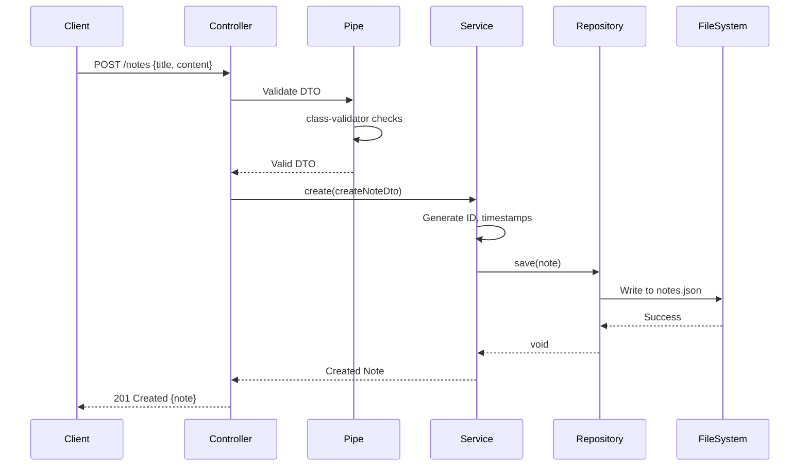

# Nest.js Architecture - Quick Notes API

> **Understanding the layered architecture and design patterns in Nest.js**

## 🏗️ Overview

Nest.js follows a **modular, layered architecture** inspired by Angular. If you know Angular's architecture, you already understand 70% of Nest.js!

---

## 📊 High-Level Architecture

```
┌─────────────────────────────────────────────┐
│           HTTP Request (Client)             │
└─────────────────┬───────────────────────────┘
                  │
┌─────────────────▼───────────────────────────┐
│              CONTROLLER                      │
│  • Handles HTTP requests                    │
│  • Route definitions (@Get, @Post, etc.)    │
│  • Request validation (Pipes)               │
│  • Response formatting                      │
└─────────────────┬───────────────────────────┘
                  │
┌─────────────────▼───────────────────────────┐
│               SERVICE                        │
│  • Business logic                           │
│  • Orchestrates data operations             │
│  • No HTTP knowledge                        │
│  • Reusable across controllers              │
└─────────────────┬───────────────────────────┘
                  │
┌─────────────────▼───────────────────────────┐
│            REPOSITORY (Optional)             │
│  • Data access layer                        │
│  • Database/File operations                 │
│  • Abstract storage details                 │
└─────────────────┬───────────────────────────┘
                  │
┌─────────────────▼───────────────────────────┐
│          DATA STORE (File/Database)         │
└─────────────────────────────────────────────┘
```

---

## 🧩 Core Components

### 1. **Modules** - Organization Units

**Purpose:** Group related functionality together

**Angular Equivalent:** `@NgModule()`

```typescript
// notes.module.ts
@Module({
  imports: [ConfigModule], // Other modules we depend on
  controllers: [NotesController], // HTTP handlers
  providers: [NotesService], // Injectable services
  exports: [NotesService], // What we expose to other modules
})
export class NotesModule {}
```

**Key Concepts:**

- **Imports:** Modules this module depends on
- **Controllers:** HTTP request handlers (routes)
- **Providers:** Services, repositories, utilities (injectable)
- **Exports:** What other modules can use

**Rule of Thumb:**

- One module per feature (NotesModule, UsersModule, etc.)
- Root module (AppModule) imports feature modules
- Modules are **singletons** - shared across the app

---

### 2. **Controllers** - HTTP Layer

**Purpose:** Handle incoming requests, return responses

**Angular Equivalent:** Think of it like `@Component()`, but for HTTP instead of UI

```typescript
// notes.controller.ts
@Controller("notes") // Route prefix: /notes
export class NotesController {
  constructor(private notesService: NotesService) {}

  @Get() // GET /notes
  findAll(@Query("search") search?: string) {
    return this.notesService.findAll(search);
  }

  @Post() // POST /notes
  create(@Body() createNoteDto: CreateNoteDto) {
    return this.notesService.create(createNoteDto);
  }

  @Get(":id") // GET /notes/:id
  findOne(@Param("id") id: string) {
    return this.notesService.findOne(id);
  }
}
```

**Responsibilities:**

- ✅ Define routes (`@Get()`, `@Post()`, `@Patch()`, `@Delete()`)
- ✅ Extract request data (`@Body()`, `@Param()`, `@Query()`)
- ✅ Call service methods
- ✅ Return responses

**NOT Responsible For:**

- ❌ Business logic (delegate to service)
- ❌ Data validation (use DTOs and Pipes)
- ❌ Database operations (delegate to service/repository)

---

### 3. **Services (Providers)** - Business Logic

**Purpose:** Implement business logic, orchestrate operations

**Angular Equivalent:** `@Injectable()` - **EXACTLY THE SAME!**

```typescript
// notes.service.ts
@Injectable()
export class NotesService {
  constructor(private notesRepository: NotesRepository) {}

  async create(createNoteDto: CreateNoteDto): Promise<Note> {
    const note: Note = {
      id: uuid(),
      ...createNoteDto,
      createdAt: new Date(),
      updatedAt: new Date(),
    };

    await this.notesRepository.save(note);
    return note;
  }

  async findAll(search?: string): Promise<Note[]> {
    const notes = await this.notesRepository.getAll();

    if (search) {
      return notes.filter(
        (note) => note.title.includes(search) || note.content.includes(search),
      );
    }

    return notes;
  }
}
```

**Responsibilities:**

- ✅ Business logic (validation, calculations, transformations)
- ✅ Orchestrate data operations
- ✅ Error handling and logging
- ✅ No HTTP awareness (pure business logic)

**NOT Responsible For:**

- ❌ HTTP request/response handling
- ❌ Direct file/database access (use repository)

---

### 4. **Repository (Data Access Layer)**

**Purpose:** Abstract data storage operations

**Pattern:** Repository Pattern - separate data access from business logic

```typescript
// notes.repository.ts
@Injectable()
export class NotesRepository {
  private readonly dataPath = "./data/notes.json";

  async getAll(): Promise<Note[]> {
    const data = await readFile(this.dataPath, "utf-8");
    return JSON.parse(data);
  }

  async save(note: Note): Promise<void> {
    const notes = await this.getAll();
    notes.push(note);
    await writeFile(this.dataPath, JSON.stringify(notes, null, 2));
  }

  async findById(id: string): Promise<Note | null> {
    const notes = await this.getAll();
    return notes.find((note) => note.id === id) || null;
  }
}
```

**Why Separate?**

- ✅ Easy to switch storage (JSON → PostgreSQL)
- ✅ Services don't know about file/database structure
- ✅ Easier to test (mock repository)
- ✅ Single Responsibility Principle

---

## 🔄 Dependency Injection (DI)

**Angular Connection:** Nest.js uses the **SAME** DI pattern as Angular!

### How It Works

```typescript
// 1. Mark class as injectable
@Injectable()
export class NotesService {}

// 2. Register in module providers
@Module({
  providers: [NotesService], // Nest creates singleton instance
})
// 3. Inject into constructor
@Controller("notes")
export class NotesController {
  constructor(private notesService: NotesService) {}
  // Nest automatically injects NotesService instance
}
```

### DI Scopes

| Scope         | Lifespan                                | Use Case              |
| ------------- | --------------------------------------- | --------------------- |
| **DEFAULT**   | Singleton (one instance for entire app) | Most services         |
| **REQUEST**   | New instance per request                | Request-specific data |
| **TRANSIENT** | New instance each time injected         | Stateful services     |

**For MVP:** Use DEFAULT scope (singleton) - simplest and most common.

---

## 📁 File & Folder Structure

### Recommended Structure (Nest.js Official)

```
src/
├── main.ts                    # Application entry point
├── app.module.ts              # Root module
├── app.controller.ts          # Root controller (optional)
├── app.service.ts             # Root service (optional)
│
├── notes/                     # Feature module (one per feature)
│   ├── dto/                   # Data Transfer Objects
│   │   ├── create-note.dto.ts
│   │   └── update-note.dto.ts
│   ├── entities/              # Domain models
│   │   └── note.entity.ts
│   ├── notes.controller.ts    # HTTP layer
│   ├── notes.service.ts       # Business logic
│   ├── notes.repository.ts    # Data access (optional)
│   ├── notes.module.ts        # Module definition
│   │
│   └── __tests__/             # Tests (optional structure)
│       ├── notes.controller.spec.ts
│       └── notes.service.spec.ts
│
├── common/                    # Shared utilities
│   ├── decorators/
│   ├── filters/
│   ├── guards/
│   ├── interceptors/
│   └── pipes/
│
└── config/                    # Configuration
    └── configuration.ts
```

### File Naming Conventions

| Type           | Pattern                  | Example                 |
| -------------- | ------------------------ | ----------------------- |
| **Module**     | `<name>.module.ts`       | `notes.module.ts`       |
| **Controller** | `<name>.controller.ts`   | `notes.controller.ts`   |
| **Service**    | `<name>.service.ts`      | `notes.service.ts`      |
| **Repository** | `<name>.repository.ts`   | `notes.repository.ts`   |
| **DTO**        | `<action>-<name>.dto.ts` | `create-note.dto.ts`    |
| **Entity**     | `<name>.entity.ts`       | `note.entity.ts`        |
| **Interface**  | `<name>.interface.ts`    | `note.interface.ts`     |
| **Test**       | `<name>.spec.ts`         | `notes.service.spec.ts` |

**Key Rule:** Always use **kebab-case** for file names!

---

## 🔀 Request/Response Flow

### Example: Creating a Note



### Flow Explanation

1. **Client** sends HTTP POST request
2. **Controller** receives request with `@Post()` decorator
3. **Pipe** (ValidationPipe) validates DTO using class-validator
4. **Controller** calls `service.create()`
5. **Service** adds business logic (ID, timestamps)
6. **Service** calls `repository.save()`
7. **Repository** writes to file system
8. Response bubbles back up the chain
9. **Client** receives 201 response with created note

---

## 🎯 Where to Put What?

### Decision Matrix

| Logic Type                 | Goes In                | Example                     |
| -------------------------- | ---------------------- | --------------------------- |
| **HTTP routing**           | Controller             | `@Get(':id')`               |
| **Request validation**     | DTO + Pipe             | `@IsString() title: string` |
| **Business rules**         | Service                | "Title must be unique"      |
| **Data transformation**    | Service                | Generate ID, timestamps     |
| **Database/File ops**      | Repository             | Read/write JSON file        |
| **Cross-cutting concerns** | Middleware/Interceptor | Logging, auth               |

### Quick Test: "Does it belong here?"

**Controller Question:** "Is this HTTP-specific?"

- ✅ Yes → Controller
- ❌ No → Service

**Service Question:** "Is this business logic?"

- ✅ Yes → Service
- ❌ No → Repository or Utility

**Repository Question:** "Is this data access?"

- ✅ Yes → Repository
- ❌ No → Service

---

## 🔗 Angular → Nest.js Architecture Mapping

| Concept          | Angular           | Nest.js             | Same?                |
| ---------------- | ----------------- | ------------------- | -------------------- |
| **Organization** | `@NgModule()`     | `@Module()`         | ✅ Almost identical! |
| **HTTP Handler** | `@Component()`    | `@Controller()`     | ⚠️ Different purpose |
| **Service**      | `@Injectable()`   | `@Injectable()`     | ✅ Exactly the same! |
| **DI System**    | Angular DI        | Nest.js DI          | ✅ Same pattern!     |
| **Routing**      | `RouterModule`    | `@Get()`, `@Post()` | ⚠️ Decorator-based   |
| **Guards**       | `CanActivate`     | `CanActivate`       | ✅ Same interface!   |
| **Interceptors** | `HttpInterceptor` | `NestInterceptor`   | ✅ Similar concept!  |
| **Pipes**        | Template pipes    | Validation pipes    | ⚠️ Different purpose |

**Key Insight:** Nest.js borrowed heavily from Angular! Your Angular knowledge applies directly.

---

## 📦 Module Relationships

### Import Chain Example

```typescript
// app.module.ts (Root)
@Module({
  imports: [
    ConfigModule.forRoot(), // Global config
    NotesModule, // Feature module
  ],
})
export class AppModule {}

// notes.module.ts (Feature)
@Module({
  imports: [ConfigModule], // Use shared config
  controllers: [NotesController],
  providers: [NotesService, NotesRepository],
  exports: [NotesService], // Other modules can use this
})
export class NotesModule {}
```

### Module Communication

**Option 1: Export/Import**

```typescript
// NotesModule exports NotesService
// UsersModule imports NotesModule
// UsersService can inject NotesService
```

**Option 2: Shared Module**

```typescript
// Create SharedModule
// Export common services
// Import SharedModule everywhere needed
```

---

## 🛡️ Middleware & Request Pipeline

### Request Processing Order

```
1. Middleware (global)
   ↓
2. Guards (route-level)
   ↓
3. Interceptors (before)
   ↓
4. Pipes (validation/transform)
   ↓
5. Controller Handler
   ↓
6. Service Logic
   ↓
7. Interceptors (after)
   ↓
8. Exception Filters (if error)
   ↓
9. Response to client
```

### When to Use Each

| Layer            | Purpose                     | Example                |
| ---------------- | --------------------------- | ---------------------- |
| **Middleware**   | Request preprocessing       | Logging, CORS          |
| **Guards**       | Authorization checks        | Is user authenticated? |
| **Interceptors** | Transform request/response  | Add timestamps         |
| **Pipes**        | Validation & transformation | Validate DTO           |
| **Filters**      | Error handling              | Format errors          |

---

## 📚 Best Practices

### ✅ DO

1. **One module per feature** - Keep related code together
2. **Thin controllers** - Delegate to services
3. **Services for business logic** - No HTTP in services
4. **Use DTOs** - Validate input with class-validator
5. **Repository pattern** - Abstract data access
6. **Dependency injection** - Constructor injection everywhere
7. **Follow naming conventions** - Use Nest CLI to generate files

### ❌ DON'T

1. **Don't put business logic in controllers** - Controllers should be thin
2. **Don't access files/DB from services** - Use repositories
3. **Don't use circular dependencies** - Refactor to avoid
4. **Don't skip validation** - Always validate input
5. **Don't hardcode values** - Use ConfigModule
6. **Don't import entire modules for one service** - Use forwardRef if needed

---

## 🎓 Learning Path

To master Nest.js architecture:

1. **Start simple** - Controller → Service (no repository yet)
2. **Add validation** - Learn DTOs and Pipes
3. **Add repository** - Separate data access
4. **Add middleware** - Cross-cutting concerns
5. **Add guards** - Authorization
6. **Add interceptors** - Transform responses

**For MVP:** Steps 1-3 are enough!

---

## 🔗 References

- [Nest.js Official Docs - Overview](https://docs.nestjs.com/first-steps)
- [Nest.js - Modules](https://docs.nestjs.com/modules)
- [Nest.js - Providers](https://docs.nestjs.com/providers)
- [Nest.js - Controllers](https://docs.nestjs.com/controllers)
- [Repository Pattern Explained](https://docs.nestjs.com/techniques/database#repository-pattern)

---

**Remember:** If you understand Angular architecture, you already understand most of Nest.js! The patterns are nearly identical. 🎯
